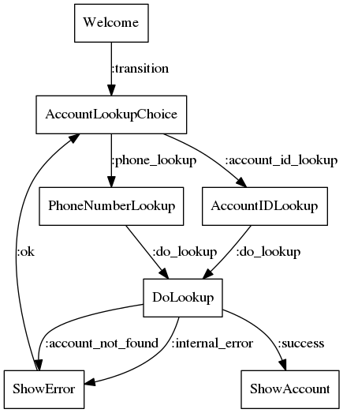

# StatesLanguageLiveView

This is a simple example of utilizing the [StatesLanguage](https://github.com/citybaseinc/states_language) library with LiveView for a multi-step form.

## Creating visual representation

I've generated a `example_workflow.dot` file and `example_workflow.png` using the following commands.

```bash
mix states_language.dot priv/state_machines/example_workflow.json > example_workflow.dot
dot -Tpng example_workflow.dot -o example_workflow.png
```

and the resulting png



## About

I'm not going to go over how to setup LiveView, their [docs](https://hexdocs.pm/phoenix_live_view/Phoenix.LiveView.html<Paste>) do a great job of that.

To get a better understanding of how this is implemented the relevant files to review are [example_workflow.json](priv/state_machines/example_workflow.json), [views/workflow.ex](lib/states_language_live_view_web/views/workflow.ex) and [workflows/example_workflow.ex](lib/states_language_live_view/workflows/example_workflow.ex). 

I've tried to provide some decent documentation to explain what's going on in the files listed above.

## Follow-up

If you have any questions feel free to ask in the [ElixirForum](https://elixirforum.com/t/stateslanguage-declaratively-design-state-machines-that-compile-to-elixir-based-gen-statem-processes-with-the-states-language-json-specification/27324/7) thread, or open an issue in this repo or the [StatesLanguage](https://github.com/citybaseinc/states_language) repo.

This is a very rudimentary use-case. All the templates are inline in our `example_workflow.ex` state machine, and the live view rendering simply replaces the whole form area. There are much better ways to utilize LiveView for rendering complex forms and handling errors, but the main point of this repo is to showcase utilizing StatesLanguage alongside LiveView. I leave the process of productionizing this to the reader.

## Use

To simulate the error transitions, enter either a "1" or a "2" into either of the account lookup types, phone number or account id. Any other values will result in a successful lookup.

To start your Phoenix server:

  * Install dependencies with `mix deps.get`
  * Install Node.js dependencies with `cd assets && npm install`
  * Start Phoenix endpoint with `mix phx.server`

Now you can visit [`localhost:4000`](http://localhost:4000) from your browser.
